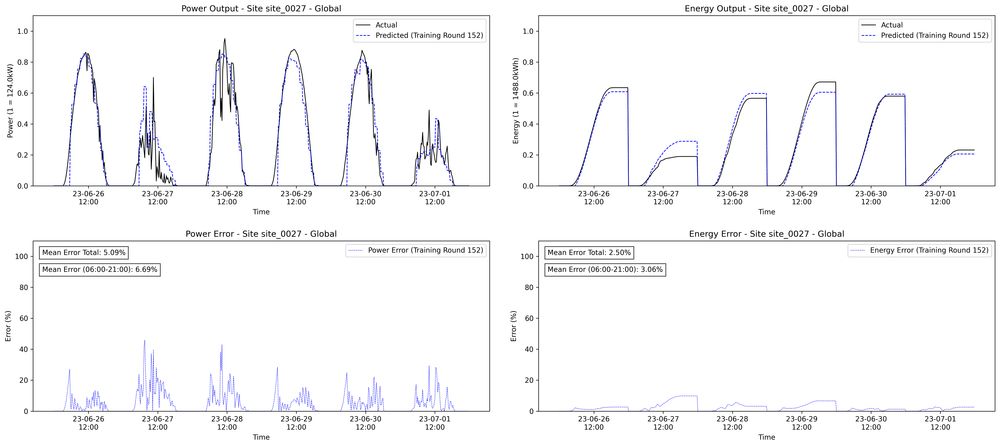
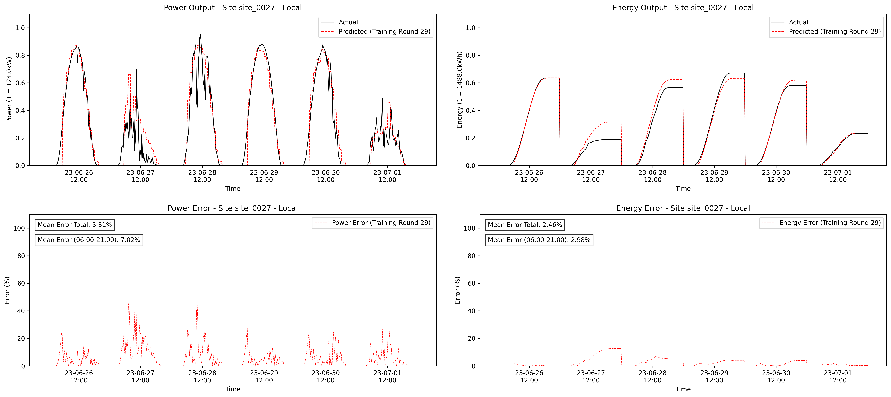
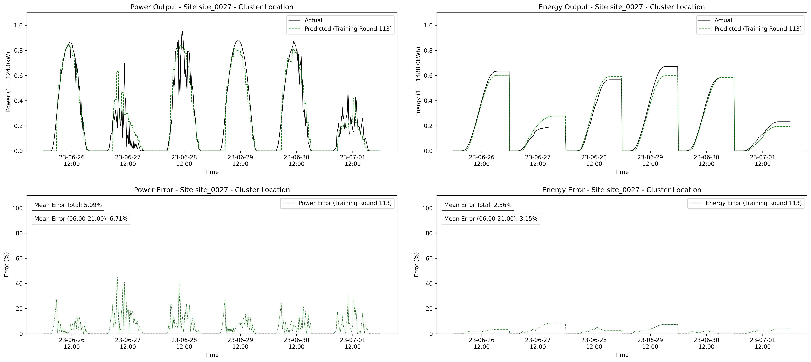
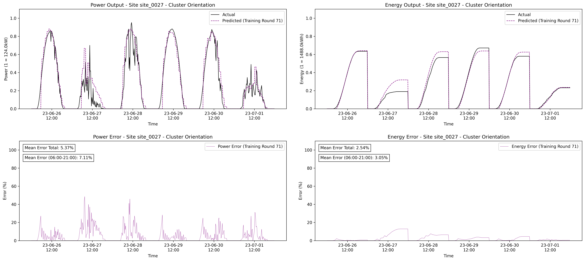
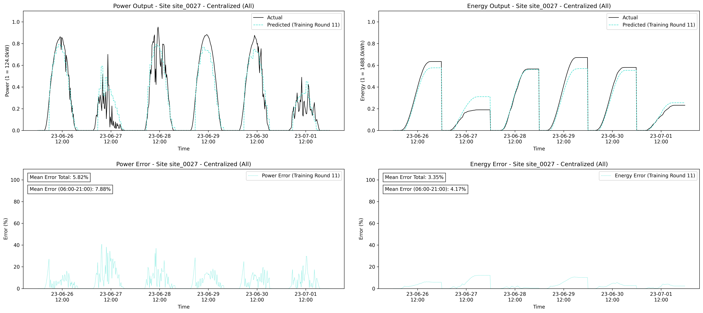
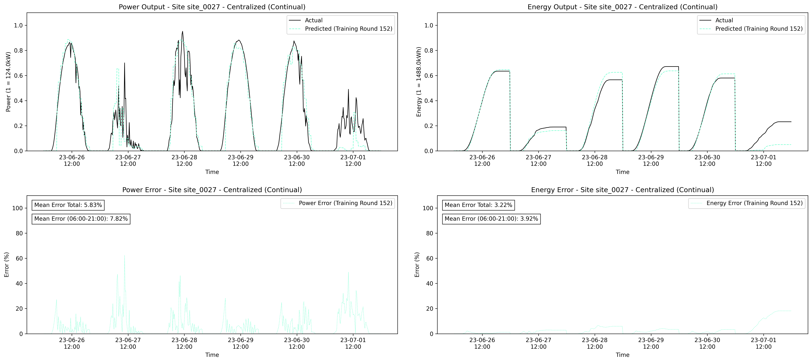

# Federated Continual Learning for Privacy-focused Energy Forecasting

## Introduction

This repository is for my Thesis at Technical University of Vienna (TU Wien) in Bachelor Software and Information Engineering. It contains the code, a brief abstract, and one example used in the research. The thesis focuses on Federated Continual Learning for privacy-focused energy forecasting, combining machine learning techniques and federated learning principles to predict energy production while maintaining data privacy. This repository is intended to showcase the research conducted during my studies and is not intended for production use.


## Abstract
This thesis presents an approach to forecasting energy production using Federated
Learning and clustering techniques. The proposed system is designed to be fully generic,
allowing any energy production site to join the network at any time without compromising
privacy or data security.
One relevant aspect of the system involves clustering energy production sites based on
relevant characteristics and creating individual cluster models. These models are then
trained using Federated Learning, ensuring that no raw data leaves the local devices. Un-
like traditional Federatead Learning approaches that use synchronous rounds, this system
implements a fully asynchronous and continual learning process, adapting to the reality
that data becomes available over time. Long Short-Term Memory (LSTM) networks
are employed as the underlying Machine Learning model. The system’s performance is
compared to centralized learning methods to evaluate its efficacy.
This research contributes to the field of federated and continual energy forecasting by
demonstrating a privacy-preserving, scalable, and adaptable approach.

## Example of Predictions

The following figures provide examples of predictions for Site 0027 during the period from 2023-06-26 to 2023-07-02. These plots demonstrate the different approaches used to forecast energy production, including federated and centralized methods.

### Federated Approaches

- **(a) Federated Global**  
  

- **(b) Federated Local**  
  

- **(c) Federated Cluster Location**  
  

- **(d) Federated Cluster Orientation**  
  

### Centralized Approaches

- **(e) Centralized (All)**  
  

- **(f) Centralized (Continual)**  
  


## Dependencies
* Docker: Required for containerizing and managing the training and prediction processes in a portable manner.


## How to Start Training

To begin training the system using the provided files, follow these steps. These files configure different components of the system, including the client and server components for both training and prediction tasks. Below is a guide to get started:

### 1. Set Up Docker Environment
Ensure that Docker is installed and running on your machine. Docker containers are used to orchestrate the components involved in the federated learning process.

### 2. Use Docker Compose

- **Centralized Client Prediction**: If you want to run a prediction using a centralized client model, use the `docker-compose.centralized-client-prediction.yml` file.
    ```bash
    docker-compose -f docker-compose.centralized-client-prediction.yml up
    ```

- **Centralized Client Training**: To train the model using centralized methods, use the `docker-compose.centralized-client-training.yml` file.
    ```bash
    docker-compose -f docker-compose.centralized-client-training.yml up
    ```

- **Client Prediction**: For federated client prediction tasks, use the `docker-compose.client-prediction.yml` file.
    ```bash
    docker-compose -f docker-compose.client-prediction.yml up
    ```

- **Client Training**: To initiate federated client-side training, use the `docker-compose.client-training.yml` file.
    ```bash
    docker-compose -f docker-compose.client-training.yml up
    ```

- **Server Configuration**: The server side of the federated learning system is configured in `docker-compose.server.yml`. It manages the overall process of coordinating clients and performing model aggregation.
    ```bash
    docker-compose -f docker-compose.server.yml up
    ```

### 3. Train the Model
To start training, you will need to run the appropriate Docker Compose commands based on your setup. If you are focusing on federated learning, you will primarily use `docker-compose.client-training.yml` for client-side model training. 

After starting the Docker containers, the clients will start their local training using their respective datasets, without sharing raw data with the server. The server will aggregate the model updates asynchronously, allowing continual learning over time.

